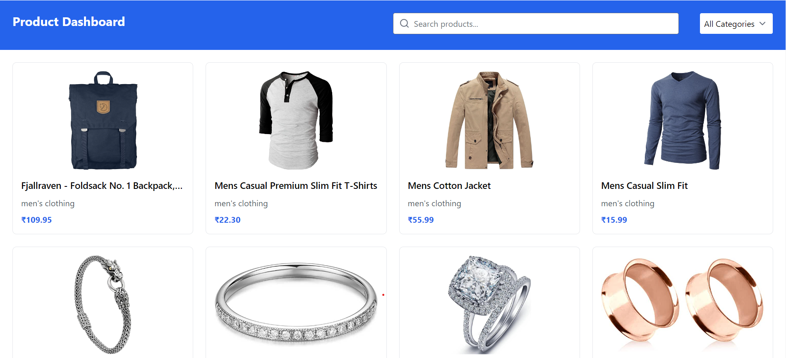
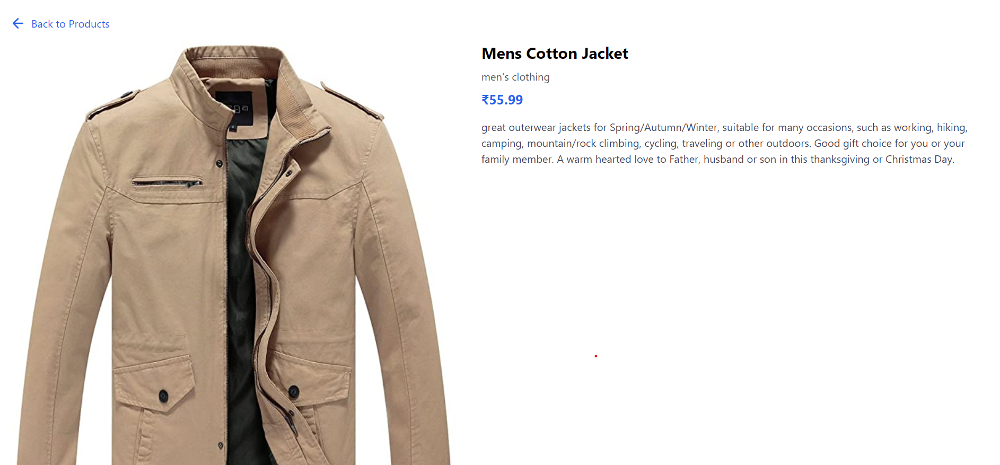

## 🌐 Live link: [Live Demo](https://product-dashboard-task.vercel.app/)

# Product Dashboard

Basic product dashboard built with React, Redux Toolkit, and Tailwind CSS. It fetches product data from the Fake Store API and implements search and category filtering.

 


## Features

- Display a list of products with images, titles, prices, and categories
- Search products by title
- Filter products by category
- View detailed product information on a separate page
- Responsive design using Tailwind CSS

## Getting Started

1. Clone the repository:
   ```
   git clone https://github.com/vivek20Eng/Product-Dashboard-Task.git
   cd product-dashboard
   ```

2. Install dependencies:
   ```
   npm install
   ```

3. Start the development server:
   ```
   npm start
   ```

4. Open [http://localhost:3000](http://localhost:3000) in your browser to view the app.

## Dependencies

- React
- Redux Toolkit
- React Router
- Axios
- Tailwind CSS
## 🖼️ Screenshots

 


